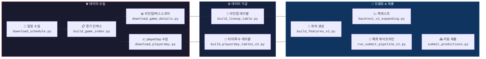

<div align="center">

# ⚾ KBO 2026 Prediction

**STATIZ AI 승부예측대회 — KBO 경기 승패 예측 프로젝트**

[](https://python.org)
[](LICENSE)
[]()

> 📊 STATIZ API 기반 데이터 수집 → v1 피처 엔지니어링 → RF+HGBDT+LR 앙상블 → 동적 스케줄러 자동 제출

</div>

---

## 🎯 핵심 원칙

<table>
<tr>
<td width="33%" align="center">

### 📅 데이터 범위
`2023` prior 전용<br>
`2024~2026` 학습/평가<br>
`2022` ❌ 사용 금지

</td>
<td width="33%" align="center">

### 🔒 누수 방지
경기일 **D** 예측 시<br>
**D-1**까지 정보만 사용<br>
당일 데이터 절대 금지

</td>
<td width="33%" align="center">

### 🔑 보안
API Key / Secret 커밋 금지<br>
raw data 커밋 금지<br>
`.env`, `*.pem` 제외

</td>
</tr>
</table>

---

## 🗺️ 데이터 파이프라인



---

## 🤖 실시간 예측 시스템

경기 당일, **경기별 시작시간에 맞춰 자동으로 라인업 수집 → 예측 → 제출**하는 동적 스케줄러입니다.

### 어떻게 동작하나요?


<table>
<tr>
<td width="50%" valign="top">

#### ⏰ 동적 스케줄링
경기 시작시간은 날마다 다를 수 있어 **고정 cron이 아닌 동적 스케줄링** 사용

| 경기시작 | 라인업 수집 | 제출 마감 |
|:--------:|:-----------:|:---------:|
| 14:00 | 13:10 | 13:45 |
| 17:00 | 16:10 | 16:45 |
| 18:30 | 17:40 | 18:15 |

```bash
# cron 설정 (매일 00:00 KST 1회)
0 0 * * * launch_scheduler.sh
```

</td>
<td width="50%" valign="top">

#### 📁 관련 파일
| 파일 | 역할 |
|------|------|
| `kbo_scheduler.py` | 동적 스케줄러 (핵심) |
| `launch_scheduler.sh` | cron 래퍼 |
| `run_submit_pipeline_v1.py` | 예측 + 제출 파이프라인 |
| `submit_predictions.py` | API 제출 전용 |
| `fetch_today_and_predict.py` | 수동 실행용 |

</td>
</tr>
</table>

---

## 🧠 v1 모델 & 피처

### 앙상블 구성

| 모델 | 설정 | 역할 |
|------|------|------|
| **RF_1200_d10** | 1200 trees, depth 10 | 비선형 패턴 포착 (메인) |
| **ET_1400_d10** | 1400 trees, depth 10 | ExtraTrees (ACC 최고) |
| **HGBDT** | 500 iter, depth 4, lr 0.05 | 그래디언트 부스팅 |
| **앙상블** | inverse-logloss 가중평균 | 최종 예측 |

> LR은 416개 피처 대비 데이터가 적어 과적합(확률 99%+ 출력) 문제로 제외

### v1 피처 (주요 추가분)

| 카테고리 | 피처 | 설명 |
|---|---|---|
| H2H | `h2h_*` | 상대전적 누적 승률/득실차 |
| 라인업 질 | `lineup_sum/core5/bottom4` | 타자 OPS 기반 라인업 평가 (전체/1-5번/6-9번) |
| 핵심 불펜 | `bp_fatigue_*` | S+HD top4 투수의 최근 3일 투구수 가중 피로도 |
| 구장 HR | `park_hr_factor` | 구장별 홈런 보정 계수 |
| SP 피안타 | `sp_slg_against` | 선발투수 피SLG 누적 |
| Cold Start | `cold_start` | 시즌 초반 전년도 데이터 fallback |
| 외국인 Cold Start | `cold_foreign_prob` | 외국인 선수는 **작년 외국인 평균** 성적을 기준값으로 사용 |

### 피처 중요도 (RF_1200_d10 Feature Importance)

> 전체 416개 피처를 카테고리별로 묶은 결과입니다. prior 피처는 blend와 중복(시즌 후반 corr>0.99)되어 제거.

| 순위 | 카테고리 | 총 중요도 | 핵심 피처 (Top 3) |
|:---:|----------|:---------:|-------------------|
| 1 | **선발투수 지표** | **32.0%** | 탈삼진율 K/9 차이, 볼넷율 BB/9 차이, WHIP 차이 |
| 2 | **불펜 피로도** | **9.6%** | 최근 3일 투구수/등판 비율 차이, 최근 3일 총투구수, WHIP 차이 |
| 3 | **라인업 질** | **7.3%** | 라인업 삼진/타수 차이, 6-9번 타자 OPS, 라인업 전체 삼진률 |
| 4 | **라인업 타격지표** | **7.1%** | 블렌드 삼진/타석 차이, 신뢰도 가중 평균 |
| 5 | **팀 승률** | **5.1%** | 홈팀 전체 승률, 승률 차이, 원정팀 원정 승률 |
| 6 | **라인업 좌우분할** | **3.1%** | 상대 투수 반대손 삼진률 차이 |
| 7 | **좌우 매치업** | **2.9%** | 반대손 타자 수 차이 (원정/차이/홈) |
| 8 | **라인업 상태** | **2.3%** | 전날 출전 비율, 전날 출전 수 |
| 9 | **라인업 선구안** | **2.1%** | 볼넷/타석 차이, 삼진/타석 차이 |
| 10 | **H2H 상대전적** | **0.9%** | 홈팀 상대전적 승률, 원정팀 상대전적 승률 |
| 11 | **구장 HR** | **0.4%** | 구장 홈런 파크팩터 |

<details>
<summary><b>개별 피처 Top 20 상세보기</b></summary>

| 순위 | 피처명 | 중요도 | 의미 |
|:---:|--------|:------:|------|
| 1 | `diff_lineup_sum_so_per_ab` | 0.73% | 양팀 라인업 삼진/타수 합계 차이 |
| 2 | `diff_count_matchup_edge` | 0.72% | 양팀 좌우 매치업 유리함 차이 |
| 3 | `diff_sp_blend_K9` | 0.68% | 양팀 선발투수 탈삼진율(K/9) 블렌드 차이 |
| 4 | `diff_lineup_vs_throw_split_so_per_pa` | 0.67% | 양팀 라인업의 상대투수 좌우별 삼진율 차이 |
| 5 | `diff_lineup_blend_so_per_pa` | 0.67% | 양팀 라인업 삼진/타석 블렌드 차이 |
| 6 | `home_count_matchup_edge` | 0.66% | 홈팀 상대 선발투수 반대손 타자 수 |
| 7 | `diff_sp_blend_BB9` | 0.62% | 양팀 선발투수 볼넷율(BB/9) 블렌드 차이 |
| 8 | `diff_sp_time_split_WHIP` | 0.62% | 양팀 선발투수 WHIP 주야간 차이 |
| 9 | `away_count_matchup_edge` | 0.57% | 원정팀 상대 선발투수 반대손 타자 수 |
| 10 | `diff_lineup_bb_per_pa` | 0.54% | 양팀 라인업 볼넷/타석 차이 |
| 11 | `diff_sp_K9` | 0.54% | 양팀 선발투수 탈삼진율(K/9) 차이 (시즌 누적) |
| 12 | `away_lineup_vs_throw_split_so_per_pa` | 0.53% | 원정팀 라인업 좌우분할 삼진율 |
| 13 | `away_sp_blend_K9` | 0.53% | 원정 선발투수 탈삼진율 블렌드 |
| 14 | `diff_sp_blend_WHIP` | 0.53% | 양팀 선발투수 WHIP 블렌드 차이 |
| 15 | `home_sp_r5_BB9` | 0.51% | 홈팀 선발투수 최근 5경기 볼넷율 |
| 16 | `diff_sp_BB9` | 0.50% | 양팀 선발투수 볼넷율(BB/9) 차이 (시즌 누적) |
| 17 | `diff_sp_time_split_ERA` | 0.50% | 양팀 선발투수 ERA 주야간 차이 |
| 18 | `diff_sp_SO_per_IP` | 0.50% | 양팀 선발투수 이닝당 탈삼진 차이 |
| 19 | `diff_lineup_hist_reliability_avg` | 0.48% | 양팀 라인업 과거 기록 신뢰도 평균 차이 |
| 20 | `away_lineup_state_y_rate` | 0.48% | 원정팀 라인업 중 전날 출전한 비율 |

</details>

### 백테스트 성적 (Expanding Window, 725경기)

| 모델 | LogLoss ↓ | Accuracy | AUC ↑ |
|------|:---------:|:--------:|:-----:|
| **RF_1200_d10** | **0.668** | **60.0%** | 0.627 |
| **ET_1400_d10** | 0.669 | 59.7% | **0.631** |
| HGBDT | 0.735 | 58.5% | 0.624 |
| Ensemble(top2) | **0.668** | **60.0%** | 0.630 |

---

## 📂 스크립트 맵

### 🌐 수집 단계

| 순서 | 스크립트 | 설명 | 산출물 |
|:---:|----------|------|--------|
| 1️⃣ | `download_schedule.py` | STATIZ API로 시즌 일정 수집 | `raw_schedule/*.json` |
| 2️⃣ | `build_game_index.py` | 경기번호(s_no) 목록 + 실제 경기 필터링 | `game_index.csv` · `game_index_played.csv` |
| 3️⃣ | `download_game_details.py` | 경기별 라인업 + 박스스코어 수집 | `raw_lineup/*.json` · `raw_boxscore/*.json` |
| 4️⃣ | `download_playerday.py` | 선수별 일자별 누적기록 수집 | `raw_playerday/*.json` |

### ⚙️ 가공 단계

| 순서 | 스크립트 | 설명 | 산출물 |
|:---:|----------|------|--------|
| 5️⃣ | `build_lineup_table.py` | raw 라인업을 long 형태로 변환 | `lineup_long.csv` |
| 6️⃣ | `build_playerday_tables_v2.py` | raw playerDay를 타자/투수 테이블로 변환 | `playerday_batter_long.csv` · `playerday_pitcher_long.csv` |

### 🧪 모델링 & 제출 단계

| 순서 | 스크립트 | 설명 | 산출물 |
|:---:|----------|------|--------|
| 7️⃣ | `build_features_v1.py` | v1 피처 생성 (H2H, 불펜, 라인업 등) | `features_v1.csv` |
| 8️⃣ | `backtest_v1_expanding.py` | Expanding window 백테스트 | `backtest_v1_expanding_report.csv` |
| 8️⃣ | `backtest_v3_model_zoo.py` | 모델 Zoo 유틸 (공용 라이브러리) | - |
| 9️⃣ | `run_submit_pipeline_v1.py` | 학습 → 예측 → 앙상블 → 제출 | `pred_v1_today.csv` |
| 🔟 | `submit_predictions.py` | savePrediction API 제출 | `save_prediction_result.csv` |

### ⏰ 자동화

| 스크립트 | 설명 |
|----------|------|
| `kbo_scheduler.py` | 동적 스케줄러: 00시 모델 업데이트 + 경기별 T-50분 라인업 수집/예측/제출 |
| `launch_scheduler.sh` | cron용 래퍼 (환경변수 로드 + 로그) |
| `fetch_today_and_predict.py` | 수동 실행용 전체 파이프라인 |
| `daily_update_v1.sh` | 수동 일일 업데이트 셸 스크립트 |

---

## 🚀 Quick Start

> 전제: STATIZ API는 **허용 IP(화이트리스트)** 기반 — **EC2(등록된 고정 IP)에서 실행** 권장

### 1) Key/Secret 환경변수 설정 (필수)
```bash
export STATIZ_API_KEY="..."
export STATIZ_SECRET="..."
```

### 2) 데이터 수집 (초기 세팅, 최초 1회)
```bash
python3 scripts/download_schedule.py --date-from 20230101 --date-to 20260329
python3 scripts/download_game_details.py --date-from 20230101 --date-to 20260329
python3 scripts/download_playerday.py --date-from 20230101 --date-to 20260329
```

### 3) 테이블 & 피처 빌드
```bash
python3 scripts/build_game_index.py
python3 scripts/build_lineup_table.py
python3 scripts/build_playerday_tables_v2.py
python3 scripts/build_features_v1.py
```

### 4) 백테스트 실행
```bash
python3 scripts/backtest_v1_expanding.py --lightweight
```

### 5) 수동 예측 & 제출
```bash
# 오늘 경기 예측 (dry-run)
python3 scripts/run_submit_pipeline_v1.py --date 20260329 --skip-submit

# 실제 제출
python3 scripts/run_submit_pipeline_v1.py --date 20260329
```

### 6) 자동 제출 설정 (cron)
```bash
crontab -e
# 추가 (매일 00:00 KST):
0 0 * * * /path/to/scripts/launch_scheduler.sh >> ~/statiz/logs/scheduler.log 2>&1
```

---

## 🔑 핵심 CSV 컬럼 요약

<details>
<summary><b>lineup_long.csv</b> — 경기별 선수 라인업</summary>

```
date, s_no, t_code, side, battingOrder, position, starting, lineupState,
p_no, p_name, p_bat, p_throw, p_backNumber
```
- `side`: 홈/원정 구분
- `p_bat`: 타석 (1=우, 2=좌, 3=양)
- `p_throw`: 투구 (1/2=우, 3/4=좌)
</details>

<details>
<summary><b>playerday_batter_long.csv</b> — 타자 일자별 누적기록</summary>

```
PA, AB, R, H, 1B, 2B, 3B, HR, TB, RBI, BB, HP, SF, OPS, NP,
battingOrder, position
```
</details>

<details>
<summary><b>playerday_pitcher_long.csv</b> — 투수 일자별 누적기록</summary>

```
IP, TBF, AB, H, BB, TB, SF, NP, S, HD, OPS, ERA, WHIP
```
- `IP`: 이닝 (6.1, 6.2 표기 → 아웃카운트 변환 필요)
</details>

---

<div align="center">

**Made with ⚾ for STATIZ AI 승부예측대회 2026**

</div>
