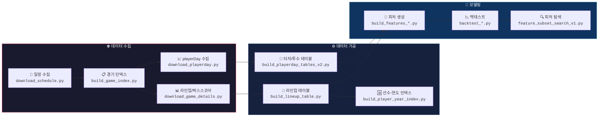

<div align="center">

# ⚾ KBO 2026 Prediction

**STATIZ AI 승부예측대회 — KBO 경기 승패 예측 프로젝트**

[](https://python.org)
[](LICENSE)
[]()

> 📊 STATIZ API 기반 데이터 수집 → 피처 엔지니어링 → Expanding Window 백테스트

</div>

---

## 🎯 핵심 원칙

<table>
<tr>
<td width="33%" align="center">

### 📅 데이터 범위
`2023` prior 전용<br>
`2024~2025` 학습/평가<br>
`2022` ❌ 사용 금지

</td>
<td width="33%" align="center">

### 🔒 누수 방지
경기일 **D** 예측 시<br>
**D-1**까지 정보만 사용<br>
당일 데이터 절대 금지

</td>
<td width="33%" align="center">

### 🔑 보안
API Key / Secret 커밋 금지<br>
raw data 커밋 금지<br>
`.env`, `*.pem` 제외

</td>
</tr>
</table>

---

## 🗺️ 데이터 파이프라인

전체 데이터 흐름을 한 눈에 볼 수 있습니다.



---

## 📂 스크립트 맵

각 단계에서 어떤 스크립트를 실행하고, 어떤 파일이 생성되는지 정리한 표입니다.

### 🌐 수집 단계

| 순서 | 스크립트 | 설명 | 산출물 |
|:---:|----------|------|--------|
| 1️⃣ | `download_schedule.py` | STATIZ API로 시즌 일정 수집 | `data/raw_schedule/*.json` |
| 2️⃣ | `build_game_index.py` | 경기번호(s_no) 목록 + 실제 경기 필터링 | `game_index.csv` · `game_index_played.csv` |
| 3️⃣ | `download_game_details.py` | 경기별 라인업 + 박스스코어 수집 | `data/raw_lineup/*.json` · `data/raw_boxscore/*.json` |
| 4️⃣ | `download_playerday.py` | 선수별 일자별 누적기록 수집 | `data/raw_playerday/*.json` |

### ⚙️ 가공 단계

| 순서 | 스크립트 | 설명 | 산출물 |
|:---:|----------|------|--------|
| 5️⃣ | `build_lineup_table.py` | raw 라인업을 long 형태로 변환 | `lineup_long.csv` |
| 6️⃣ | `build_player_year_index.py` | 라인업 기반 (p_no, year) 인덱스 생성 | `player_year_index.csv` |
| 7️⃣ | `build_playerday_tables_v2.py` | raw playerDay를 타자/투수 테이블로 변환 | `playerday_batter_long.csv` · `playerday_pitcher_long.csv` |

### 🧪 실험 단계

| 순서 | 스크립트 | 설명 | 산출물 |
|:---:|----------|------|--------|
| 8️⃣ | `build_features_v1_paper.py` | 핵심 4피처 생성 | `features_v1_paper.csv` |
| 8️⃣ | `build_features_v2_candidates.py` | 기존 4 + 새 후보 8 = 12피처 생성 | `features_v2_candidates.csv` |
| 9️⃣ | `backtest_v1_online_lr.py` | Expanding window 백테스트 | `backtest_pred_v1.csv` |
| 9️⃣ | `feature_subset_search_v1.py` | 전체 subset 자동 탐색 (최대 4095 조합) | `feature_subset_search_v1.csv` |
| 🔟 | `backtest_top10_block_report_v1.py` | 상위 조합 주차별 상세 리포트 | `top10_subset_*.csv` |
| 🔟 | `inspect_lr_coef_v1.py` | 로지스틱 회귀 계수 해석 | `backtest_lr_coef_v1.csv` |

---

## 🏗️ 피처 사전

### 기존 핵심 4피처 (v1)

| 피처명 | 설명 | 데이터 원천 |
|--------|------|-------------|
| `diff_sum_ops_smooth` | 양 팀 선발 1~9번 타자 시즌 누적 OPS 합 차이 (K=20 smoothing) | `playerday_batter_long` |
| `diff_sum_ops_recent5` | 양 팀 선발 타자 최근 5경기 OPS 합 차이 | `playerday_batter_long` |
| `diff_sp_oops` | 양 팀 선발투수 피OPS 차이 (K=20 smoothing) | `playerday_pitcher_long` |
| `diff_bullpen_fatigue` | 핵심 불펜 4명의 가중 피로도 합 차이 | `playerday_pitcher_long` |

### 새 후보 피처 (v2)

| 피처명 | 설명 | 데이터 원천 |
|--------|------|-------------|
| `diff_opp_sp_platoon_cnt` | 상대 선발투수와 반대손 타자 수 차이 | `lineup_long` |
| `diff_sp_bbip` | 선발투수 BB/IP 차이 (제구력 지표) | `playerday_pitcher_long` |
| `diff_pythag_winpct` | 피타고리안 승률 차이 (팀 전력 수준) | `game_index_played` |
| `diff_recent10_winpct` | 최근 10경기 승률 차이 (최근 폼) | `game_index_played` |
| `diff_top5_ops_smooth` | 상위 5번 타순 OPS 합 차이 | `playerday_batter_long` |
| `diff_team_stadium_winpct` | 해당 구장에서의 팀 승률 차이 | `game_index_played` |
| `park_factor_stadium` | 구장 파크팩터 | `game_index_played` |
| `diff_team_stadium_winpct_pfadj` | 구장 승률 × 파크팩터 보정 | `game_index_played` |

---

## 📊 실험 결과 요약

### 모델 설정

| 항목 | 설정 |
|------|------|
| 모델 | `StandardScaler` + `LogisticRegression` |
| 평가 방식 | Expanding Window |
| Seed Train | 2024 시즌 |
| Test | 2025 시즌 |
| 재학습 주기 | 7일 |

### 성능 비교

| 실험 | ACC | LOGLOSS ↓ | BRIER ↓ | AUC ↑ |
|------|:---:|:---------:|:-------:|:-----:|
| **v1 기준선** (4피처) | 0.547 | 0.6865 | 0.2467 | 0.5676 |
| **v2 최고 조합** (3피처) | **0.582** | **0.6746** | **0.2408** | **0.6153** |

> 🏆 **현재 최고 조합**: `diff_bullpen_fatigue` + `diff_sp_bbip` + `diff_pythag_winpct`

---

## 🚀 Quick Start

```bash
# EC2 접속 후 가상환경 활성화
cd ~/statiz && source .venv/bin/activate

# 1. 데이터 수집 (이미 완료된 경우 생략)
python download_schedule.py
python build_game_index.py
python download_game_details.py
python download_playerday.py

# 2. 데이터 가공
python build_lineup_table.py
python build_player_year_index.py
python build_playerday_tables_v2.py

# 3. 피처 생성 & 백테스트
python build_features_v2_candidates.py
python feature_subset_search_v1.py
python backtest_top10_block_report_v1.py
```

---

## 📁 프로젝트 구조

```
kbo-2026-prediction/
├── 📄 README.md                           ← 이 문서
├── 📄 LICENSE
├── 📄 .gitignore
└── 📂 scripts/
    ├── 🌐 download_schedule.py            1단계  일정 수집
    ├── 📋 build_game_index.py             2단계  경기 인덱스
    ├── 🌐 download_game_details.py        3단계  상세 수집
    ├── 🌐 download_playerday.py           4단계  playerDay 수집
    ├── 👥 build_lineup_table.py           5단계  라인업 테이블
    ├── 🆔 build_player_year_index.py      6단계  선수 인덱스
    ├── ⚙️ build_playerday_tables_v2.py     7단계  타자/투수 테이블
    ├── 🔧 build_features_v1_paper.py      8단계  v1 피처
    ├── 🔧 build_features_v2_candidates.py 8단계  v2 피처
    ├── 📉 backtest_v1_online_lr.py        9단계  백테스트
    ├── 🔍 feature_subset_search_v1.py     9단계  subset 탐색
    ├── 📊 backtest_top10_block_report_v1.py 10단계 상위 리포트
    └── 🔬 inspect_lr_coef_v1.py           10단계 계수 해석
```

> 💡 **참고**: EC2 `~/statiz/`에서는 스크립트가 루트에 직접 있고, GitHub repo에서는 `scripts/` 아래에 정리되어 있습니다.

---

## 🔑 핵심 CSV 컬럼 요약

<details>
<summary><b>lineup_long.csv</b> — 경기별 선수 라인업</summary>

```
date, s_no, t_code, side, battingOrder, position, starting, lineupState,
p_no, p_name, p_bat, p_throw, p_backNumber
```
- `side`: 홈/원정 구분
- `p_bat`: 타석 (1=우, 2=좌, 3=양)
- `p_throw`: 투구 (1/2=우, 3/4=좌)
</details>

<details>
<summary><b>playerday_batter_long.csv</b> — 타자 일자별 누적기록</summary>

```
PA, AB, R, H, 1B, 2B, 3B, HR, TB, RBI, BB, HP, SF, OPS, NP,
battingOrder, position
```
</details>

<details>
<summary><b>playerday_pitcher_long.csv</b> — 투수 일자별 누적기록</summary>

```
IP, TBF, AB, H, BB, TB, SF, NP, S, HD, OPS, ERA, WHIP
```
- `IP`: 이닝 (6.1, 6.2 표기 → 아웃카운트 변환 필요)
</details>

---

<div align="center">

**Made with ⚾ for STATIZ AI 승부예측대회 2026**

</div>
